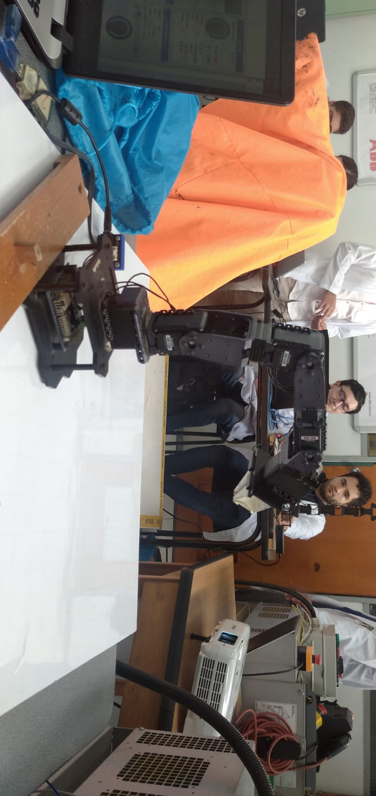
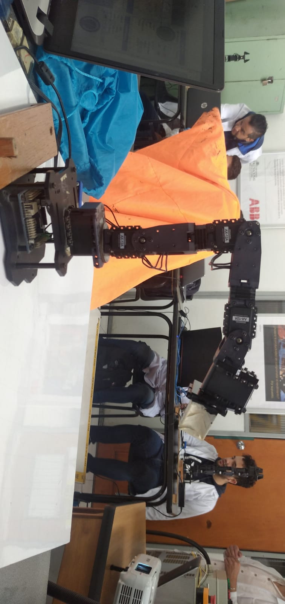
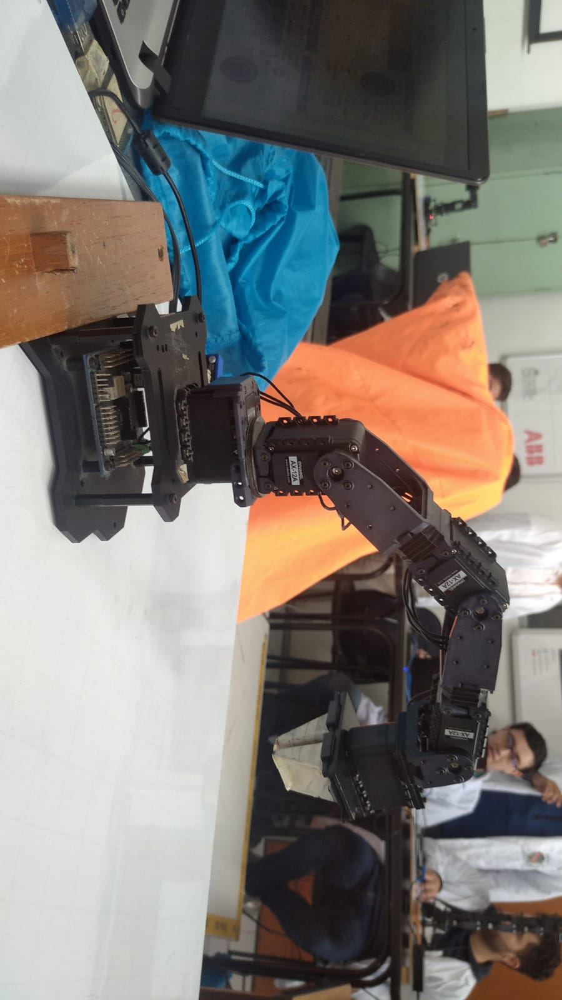
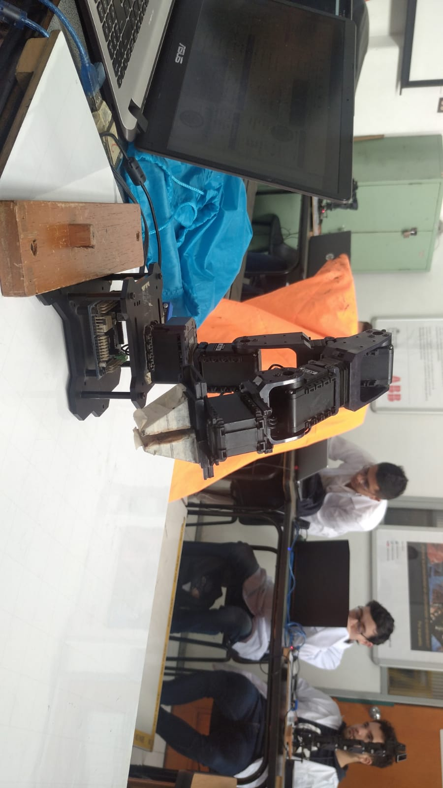

# RLab. 4 - Cinemática Directa - Phantom X - ROS

> ## Integrantes
> 
> - [Camilo Andrés Borda Gil](https://github.com/Canborda) (caabordagi@unal.edu.co)
> - [Paula Sofía Medina Diaz](https://github.com/psmedinadi22) (psmedinadi@unal.edu.co)
> - Robinson Jair Orduxz Gomez (rjorduzg@unal.edu.co)

---
# Cinematica directa
Para hallar los parámetros DH del robot Phantom X Pincher primero hay que obtener las longitudes de eslabón para cada articulación del robot Phantom X Pincher
<p align="center"></p>
 La medidas obtenidas por medio de la medición con calibrador fueron: l3=0, l3=10.2, l2=10.2, l1=7.8

Con lo que se puede plantear la siguiente tabla de parámetros DHstd:

| Theta |	d |	a |	alpha |	Offset |
| --- | --- | --- | --- | --- |
| Theta 1	| L1	| 0 |	90 |	0° |
| Theta 2 |	0 |	L2 |	0° |	90° |
| Theta 3 |	0 |	L3 |	0° |	0° |
| Theta 4 |	0 |	0 |	90° |	90° |
| Theta 5	| L4 |	0 |	0° |	0° |
---
# Script en Matlab

Se desarrolla un corto Script en MATLAB para crear una imagen virtual de las posiciones del robot y así poder contrastarlas con las obtenidas en el robot real.

```
 l = [0, 10.2, 10.2, 7.8];
 a=152.05-90;
 b=136.82-90;
 c= 74.12;
 d=180-108.40;
 q = [a, b, c, d]*pi/180;
 offset = [0, pi/2, 0, 0];
 DHparameters = [q(1) 5.4 l(1) pi/2 0 offset(1);
                 q(2) 0   l(2) 0    0 offset(2);
                 q(3) 0   l(3) 0    0 offset(3);
                 q(3) 0   l(4) pi/2 0 offset(4) ];
 L21(1) = Link(DHparameters(1,:));
 L21(2) = Link(DHparameters(2,:));
 L21(3) = Link(DHparameters(3,:));
 L21(4) = Link(DHparameters(4,:));
 Robot_punto21 = SerialLink(L21,'name','Home');
 ws2_2 = [-10 10 -10 10 -4.5 40];
 Robot_punto21.plot(q,'workspace',ws2_2);
 xlim([-14.0 39.5])
 ylim([-16.8 34.7])
 zlim([-41.0 73.7])
```
<p align="center"></p>

---
# Script en Python


```
from cmath import pi
import numpy as np
import rospy
import time
from std_msgs.msg import String
from sensor_msgs.msg import JointState
from dynamixel_workbench_msgs.srv import DynamixelCommand

#Arreglo de torques
Torques=[500,400,400,400,400]

#Ángulos deseados, el home y los 4 casos a evaluar
Deghome=[0,0,0,0,0]
Deg1=[-20, 20, -20, 20, 0]
Deg2=[30,-30, 30, -30, 0]
Deg3=[-90, 15, -55, 17, 0]
Deg4=[ -90, 45, -55, 45, 10]

#Función print para mostrar en consola los ángulos de los casos.
def printLB(pos):
    print('Posicion eslabones:\n')
    for i in range (len(pos)):
        print(str(i+1)+': '+"%.2f" % pos[i]+'°\t', end = ' ')
    print('\n')

#Imprimir los 4 casos posibles.
print('Ingrese caso a realizar:\n\n')
print('Caso 1. ',end = ' ')
printLB(Deg1)
print('Caso 2. ',end = ' ')
printLB(Deg2)
print('Caso 3. ',end = ' ')
printLB(Deg3)
print('Caso 4. ',end = ' ')
printLB(Deg4)

#Obtener del usuario un valor 
caso=int(input())

#Valores análogos de la posición home y los casos. Se obtuvieron desde dynamixel_wizard
PosHome=[514,510,818,512,512]
pos1An=[444,575,751,580,512]
pos2An=[614,410,922,409,512]
pos3An=[205,560,630,570,512]
pos4An=[205,660,629,666,546]

#Arreglo de los casos 1 a 4
posicionesAn=[pos1An,pos2An,pos3An,pos4An]
posicionesDeg=[Deg1,Deg2,Deg3,Deg4]

#Asigna qué caso se va a ejecutar.
CasoA=posicionesAn[caso-1]
CasoDeg=posicionesDeg[caso-1]
#Un arreglo en ceros donde se almacenarán las posiciones de los ángulos reales.
PosActual=[0,0,0,0,0]


#Función que cambia valores de registros de los motores del Pincher.
def jointCommand(command, id_num, addr_name, value, time):
    rospy.wait_for_service('dynamixel_workbench/dynamixel_command')
    try:        
        dynamixel_command = rospy.ServiceProxy('/dynamixel_workbench/dynamixel_command', DynamixelCommand)
        result = dynamixel_command(command,id_num,addr_name,value)
        rospy.sleep(time)
        return result.comm_result
    except rospy.ServiceException as exc:
        print(str(exc))

#Función callback que se llama en el listener. Cambia la variable global de la posición de los ángulos de los motores.
#Se realiza el ajuste a grados y a la posición home que se estableció
def callback(data):
    global PosActual
    PosActual=np.multiply(data.position,180/pi)
    PosActual[2]=PosActual[2]-90

#Imprime la posición real de los ángulos de los motores.
def printL(real,teorico):
    print('\nÁngulos motores:\n')
    for i in range (len(real)):
        print(str(i+1)+': '+"%.2f" % real[i]+'°\t', end = ' ')
    Verror=np.sqrt(np.mean(np.subtract(teorico,real)**2))
    print('\n\n'+'Error RMS: '+"%.2f" % Verror+'°\n')
    
#Función que genera el subscriber para obtener los estados de las articulaciones
def listener():
    rospy.init_node('joint_listener', anonymous=True)
    rospy.Subscriber("/dynamixel_workbench/joint_states", JointState,callback)

#Rutina de movimiento con puntos intermedios. Uno define el número de movimientos N para llegar a un punto.
#Se ejecuta en un ciclo for hasta llegar al punto final.
def movPartido(j,Goal,Actual):
    N=5
    delta=((Goal-Actual)/N)
    for i in range(N):
        jointCommand('', (j+1), 'Goal_Position', int(Actual+delta*(i+1)), 0.5)
        time.sleep(0.1)

#Main
if __name__ == '__main__':
    try:
        #Activar el subscriber.
        listener()

        #Definir los límites de torque de los motores.
        for i in range(5):    
            jointCommand('', (i+1), 'Torque_Limit', Torques[i], 0)
            
        #Rutina para ir al home.
        print('Ir a home\n')
        for i in range(5):
            jointCommand('', (i+1), 'Goal_Position', PosHome[i], 1)
            print('Moviento eslabon: '+str(i+1)+'\n')
            time.sleep(0.5)
        print('En home\n')

        #Imprimir la posición real respecto al home.
        printL(PosActual,Deghome)
        
        #Realizar la rutina de movimiento.
        print('Empezar rutinas\n')
        for i in range(5):
            print('Moviento eslabon: '+str(i+1))
            movPartido(i,CasoA[i],PosHome[i])
        print('Finalizada la rutina.')

        #Imprimir la posición deseada respecto a la teórica.
        printL(PosActual,CasoDeg)
    except rospy.ROSInterruptException:
        pass
```

---
# ROS

Con base en la documentación de los motores Dynamixel en ROS, se creó un script que publique a los tópicos y llame a los servicios correspondientes para realizar el movimiento de cada una de las articulaciones del manipulador (waist, shoulder, elbow, wrist). La lógica del script fue la siguiente:

- Se debe realizar el movimiento entre dos posiciones angulares características: una de home y otra objetivo.
- El movimiento de las articulaciones debe realizarse de forma secuencial iniciando por la articulacion de la base, agregue una pequeña espera entre cada movimiento para facilitar la grabacion de videos de demostracion.

```
sudo chmod 777 /dev/ttyUSB0
catkin build dynamixel_one_motor
source devel/setup.bash
roslaunch dynamixel_one_motor one_controller.launch
```


---
# Resultados

Se obtuvo de manera satisfactoria las posiciones del robot planteadas en la guia de laboratorio, el resultado de esto se puede ver a continuación

<p align="center"></p>

1. 0, 0, 0, 0, 0.
<p align="center"></p>
2. -25, 15, -20, 20, 0.
<p align="center"></p>
3. 35,-35, 30, -30, 0.
<p align="center"></p>
4. -85, 20, -55, 17, 0.
<p align="center"></p>
5. -80, 35, -55, 45, 0
<p align="center"></p>


---
# Conclusiones
- El uso de frameworks como ROS facilita significativamente la implementación de robots pequeños, como el Pincher utilizado en este laboratorio.
- Cuando el agarre superficial o el torque de las articulaciones no son suficientes, disminuir la velocidad de trabajo puede mejorar la estabilidad del robot.
- Trabajar en equipo facilita el aprendizaje en el desarrollo de los ejercicios, dado que se fomenta la discusión sobre lo que se está realizando y cómo hacerlo de la mejor manera posible.


---
# Referencias

- Laboratorio 4 - Cinemática Directa - Phantom X - ROS UNAL.
- https://github.com/fegonzalez7/rob_unal_clase4
- Apuntes de clase, Robótica 2023-1

---
