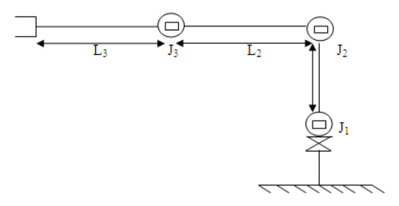
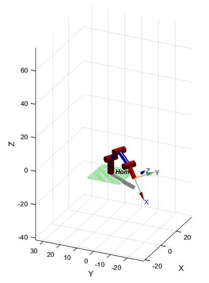

# RLab. 4 - Cinemática Directa - Phantom X - ROS

> ## Integrantes
> 
> - [Camilo Andrés Borda Gil](https://github.com/Canborda) (caabordagi@unal.edu.co)
> - [Paula Sofía Medina Diaz](https://github.com/psmedinadi22) (psmedinadi@unal.edu.co)
> - Robinson Jair Orduxz Gomez (rjorduzg@unal.edu.co)

---
# Cinematica directa
Para hallar los parámetros DH del robot Phantom X Pincher primero hay que obtener las longitudes de eslabón para cada articulación del robot Phantom X Pincher
<p align="center"></p>
 La medidas obtenidas por medio de la medición con calibrador fueron: l3=0, l3=10.2, l2=10.2, l1=7.8

Con lo que se puede plantear la siguiente tabla de parámetros DHstd:

| Theta |	d |	a |	alpha |	Offset |
| --- | --- | --- | --- | --- |
| Theta 1	| L1	| 0 |	90 |	0° |
| Theta 2 |	0 |	L2 |	0° |	90° |
| Theta 3 |	0 |	L3 |	0° |	0° |
| Theta 4 |	0 |	0 |	90° |	90° |
| Theta 5	| L4 |	0 |	0° |	0° |
---
# Script en Matlab

Se desarrolla un corto Script en MATLAB para crear una imagen virtual de las posiciones del robot y así poder contrastarlas con las obtenidas en el robot real.

```
 l = [0, 10.2, 10.2, 7.8];
 a=152.05-90;
 b=136.82-90;
 c= 74.12;
 d=180-108.40;
 q = [a, b, c, d]*pi/180;
 offset = [0, pi/2, 0, 0];
 DHparameters = [q(1) 5.4 l(1) pi/2 0 offset(1);
                 q(2) 0   l(2) 0    0 offset(2);
                 q(3) 0   l(3) 0    0 offset(3);
                 q(3) 0   l(4) pi/2 0 offset(4) ];
 L21(1) = Link(DHparameters(1,:));
 L21(2) = Link(DHparameters(2,:));
 L21(3) = Link(DHparameters(3,:));
 L21(4) = Link(DHparameters(4,:));
 Robot_punto21 = SerialLink(L21,'name','Home');
 ws2_2 = [-10 10 -10 10 -4.5 40];
 Robot_punto21.plot(q,'workspace',ws2_2);
 xlim([-14.0 39.5])
 ylim([-16.8 34.7])
 zlim([-41.0 73.7])
```
<p align="center"></p>

---
# Script en Python


---
# Resultados


---
# Conclusiones

